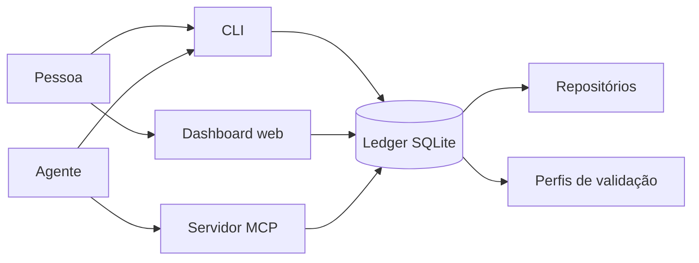
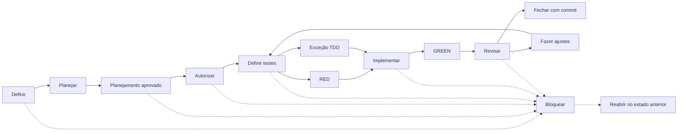

# Workflow Ledger

Um ledger local para acompanhar entregas de software feitas por pessoas e
agentes. Ele guarda o estado do trabalho, as decisões tomadas, os testes que
foram executados e o commit que encerrou cada entrega.

O projeto oferece três formas de acesso ao mesmo ledger:

- uma linha de comando (CLI);
- um servidor MCP para agentes;
- um dashboard web para inspeção e ações do dia a dia.

O estado fica em um banco SQLite local. Isso deixa o histórico perto do
código, sem depender de um serviço externo.

## O problema que ele resolve

O Workflow Ledger coordena entregas de software feitas por pessoas e agentes.
Ele transforma cada mudança em uma unidade pequena, autorizada e verificável,
com escopo, critérios, testes, evidências, revisão e commit registrados.

Isso resolve um problema comum em fluxos assistidos por agentes: o contexto se
perde entre sessões, o trabalho começa fora do escopo, os mesmos testes são
repetidos sem necessidade e nem sempre fica claro por que uma entrega foi
considerada pronta.

O ledger mantém esse histórico em um único lugar e controla a passagem entre
planejamento, autorização, implementação, validação, revisão e fechamento.
Assim, outra pessoa ou agente pode retomar o trabalho sabendo:

- o que foi decidido e autorizado;
- qual é a menor entrega em andamento;
- quais repositórios e caminhos fazem parte do escopo;
- quais testes já foram executados e com qual resultado;
- qual é o próximo passo permitido.

Ele é local, baseado em SQLite, e não substitui Git, CI ou uma ferramenta de
gestão de produto. Sua função é registrar e proteger o fluxo entre essas
ferramentas.

## Como as peças se relacionam



As três interfaces leem e escrevem no mesmo banco. O ledger consulta os
repositórios para capturar baselines de Git e executa apenas perfis de
validação previamente registrados.

## Conceitos principais

### Projeto, feature e fatia

Um **projeto** reúne repositórios e trabalho relacionado.

Uma **feature** é uma capacidade maior do produto. Ela pode ser dividida em
várias entregas.

Uma **fatia** (`WorkItem`) é uma dessas entregas. Ela deve ser pequena o
suficiente para ser autorizada, implementada e verificada como uma unidade.
Cada fatia tem uma chave própria dentro da feature. Por isso, `01` de duas
features identifica duas fatias diferentes.

Fases ou gates, como `G3` e `G6`, marcam momentos do ciclo. Eles não são
features, fatias nem estados.

### O ciclo de uma entrega



O caminho pode voltar para testes quando uma revisão pede mudanças. Qualquer
etapa, exceto `CLOSED`, pode ser bloqueada. `reopen` devolve a fatia ao estado
anterior ao bloqueio; `replan` bloqueia a fatia original e cria espaço para
entregas descendentes.

<details>
<summary>Estados registrados pelo ledger</summary>

| Estado | Significado |
| --- | --- |
| `DRAFT` | definição ainda incompleta |
| `READY` | requisitos completos e planejamento liberado |
| `AUTHORIZED` | autorização registrada e baselines capturados |
| `TESTS_DEFINED` | testes definidos |
| `RED_CONFIRMED` | RED registrado e confirmado |
| `TDD_EXCEPTION_APPROVED` | exceção documentada ao RED obrigatório |
| `IMPLEMENTING` | implementação em andamento |
| `GREEN_CONFIRMED` | GREEN passou em todos os repositórios autorizados |
| `READY_FOR_REVIEW` | evidência GREEN válida, aguardando revisão |
| `APPROVED` | revisão aprovada |
| `CHANGES_REQUIRED` | revisão exige mudanças |
| `BLOCKED` | fluxo interrompido com um motivo |
| `CLOSED` | commit registrado; estado final |

</details>

### RED, GREEN e CHECK

- **RED** roda os testes antes da implementação. Uma falha comportamental mostra
  que o teste detecta o comportamento que ainda falta. Uma falha estrutural,
  como `No tests found`, exige uma justificativa antes de ser confirmada.
- **GREEN** roda o perfil depois da implementação. A fatia só recebe esse
  estado quando todos os repositórios autorizados passam.
- **CHECK** registra uma verificação adicional. Se usar o mesmo perfil e a
  mesma worktree do GREEN, o ledger reaproveita a evidência sem repetir a
  suíte.

Se a worktree mudar depois do GREEN, a evidência fica obsoleta. É preciso
registrar a invalidação e executar GREEN novamente antes da revisão.

## Comece rápido

### Requisitos

- Node.js 20 ou mais recente;
- npm;
- Git, se você for cadastrar repositórios e executar validações.

### Instale e compile

Execute os comandos a partir desta pasta:

```bash
npm install
npm run prisma:generate
npm run prisma:migrate -- --name init
npm run build
```

Por padrão, o banco fica em `../.workflow/workflow.sqlite`. Para usar outro
arquivo, defina `DATABASE_URL` ou `WORKFLOW_DATABASE_URL`.

O diretório `.workflow/` é local e não deve ser versionado.

### Veja o estado pelo terminal

O executável do CLI aparece em `dist/interfaces/cli/main.js` depois do build:

```bash
node dist/interfaces/cli/main.js project list
node dist/interfaces/cli/main.js feature list --project <project-key>
node dist/interfaces/cli/main.js context \
  --project <project-key> --feature <feature-key> --item <item-key>
```

Use `feature list` para descobrir as chaves existentes. Depois consulte uma
fatia com `context`, informando `--feature` e `--item` explicitamente.

### Abra o dashboard

```bash
npm run start:web
```

Abra [http://127.0.0.1:4117](http://127.0.0.1:4117). O servidor fica
disponível apenas no computador local. Para trocar a porta, defina
`WORKFLOW_WEB_PORT`.

Durante o desenvolvimento, use `npm run dev:web`.

## Granularidade e replanejamento

Uma fatia grande demais cria testes difíceis de interpretar e autorizações
amplas demais. O comando abaixo verifica o tamanho e a coerência do plano:

```bash
node dist/interfaces/cli/main.js plan check \
  --project <project-key> --feature <feature-key>
```

Para cada fatia, a auditoria informa:

- `status`: `OK`, `SPLIT_RECOMMENDED` ou `EXCEPTION_REQUIRED`;
- `repositoryScope`: se o escopo técnico foi declarado;
- `semanticStatus`: se casos de uso, critérios e testes combinam entre si.

`SPLIT_RECOMMENDED` indica que dividir é o caminho esperado. `EXCEPTION_REQUIRED`
exige uma aprovação humana antes de seguir. Um problema semântico deve ser
corrigido ou replanejado; não deve ser escondido como exceção de tamanho.

### Granularidade, exceções e replanejamento

No MCP, os equivalentes são `workflow_plan_check`,
`workflow_request_slice_size_exception` e `workflow_replan_item`.

O agente não aprova a própria exceção. A fatia original permanece em `DRAFT`,
impedida de avançar até ser dividida ou até que um operador humano registre a
aprovação. A aprovação usa um ator no formato
`human:<identidade>`.

## Interfaces

| Interface | Para quem | Como iniciar |
| --- | --- | --- |
| CLI | scripts e uso no terminal | `node dist/interfaces/cli/main.js --help` |
| MCP | agentes que precisam consultar ou atualizar o ledger | `npm run start:mcp` |
| Dashboard | pessoas que preferem acompanhar o fluxo visualmente | `npm run start:web` |

### Servidor MCP

O servidor usa STDIO. Um cliente MCP pode apontar para o binário compilado:

```json
{
  "mcpServers": {
    "workflow": {
      "command": "node",
      "args": ["/caminho/para/workflow/dist/interfaces/mcp/main.js"]
    }
  }
}
```

As ferramentas de catálogo são somente leitura. Elas permitem descobrir
projetos, features, repositórios, decisões e pendências antes de consultar ou
alterar uma fatia.

## Segurança e limites

- o ledger não edita arquivos dos repositórios;
- o MCP não executa shell arbitrário;
- validações usam perfis registrados, com programa, argumentos, tempo e limite
  de saída definidos;
- uma autorização captura o estado inicial dos repositórios e rejeita uma
  worktree suja;
- depois do GREEN, qualquer mudança exige uma nova validação GREEN;
- o dashboard aceita conexões apenas de `127.0.0.1` por padrão.

O ledger não substitui Git, um sistema de CI ou uma ferramenta de gestão de
produto. Ele registra a sequência e as evidências que conectam essas etapas.

## Importação

Snapshots estruturados servem apenas para bootstrap ou migração explícita:

```bash
node dist/interfaces/cli/main.js import --file /caminho/snapshot.json
```

O arquivo precisa seguir o schema `1` e conter um `importKey`. A importação é
idempotente e não substitui as transições normais do ledger.

## Desenvolvimento

```bash
npm test
npm run test:web
npm run lint
npm run build
```

Os testes usam bancos SQLite temporários e os removem ao final de cada suíte.

## Documentação

- [AGENTS.md](AGENTS.md): instruções operacionais para agentes;
- [docs/ESTUDO-PROJETOS-SIMILARES.md](docs/ESTUDO-PROJETOS-SIMILARES.md):
  estudo de projetos relacionados a coordenação, leases, dependências e
  execução durável.
