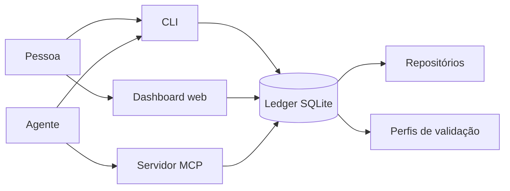
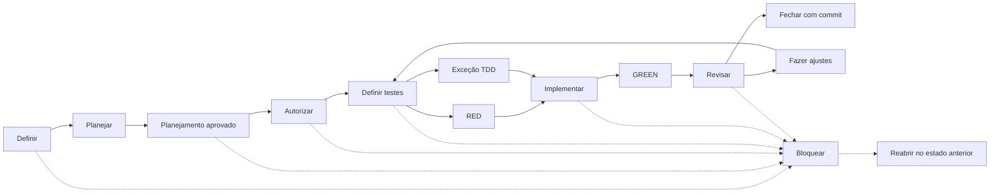

# Workflow Ledger

Um ledger local para acompanhar entregas de software feitas por pessoas e
agentes. Ele guarda o estado do trabalho, as decisões tomadas, os testes que
foram executados e o commit que encerrou cada entrega.

O projeto oferece três formas de acesso ao mesmo ledger:

- uma linha de comando (CLI);
- um servidor MCP para agentes;
- um dashboard web para inspeção e ações do dia a dia.

O estado fica em um banco SQLite local. Isso deixa o histórico perto do
código, sem depender de um serviço externo.

## O problema que ele resolve

O Workflow Ledger coordena entregas de software feitas por pessoas e agentes.
Ele transforma cada mudança em uma unidade pequena, autorizada e verificável,
com escopo, critérios, testes, evidências, revisão e commit registrados.

Isso resolve um problema comum em fluxos assistidos por agentes: o contexto se
perde entre sessões, o trabalho começa fora do escopo, os mesmos testes são
repetidos sem necessidade e nem sempre fica claro por que uma entrega foi
considerada pronta.

O ledger mantém esse histórico em um único lugar e controla a passagem entre
planejamento, autorização, implementação, validação, revisão e fechamento.
Assim, outra pessoa ou agente pode retomar o trabalho sabendo:

- o que foi decidido e autorizado;
- qual é a menor entrega em andamento;
- quais repositórios e caminhos fazem parte do escopo;
- quais testes já foram executados e com qual resultado;
- qual é o próximo passo permitido.

Ele é local, baseado em SQLite, e não substitui Git, CI ou uma ferramenta de
gestão de produto. Sua função é registrar e proteger o fluxo entre essas
ferramentas.

## Como as peças se relacionam



As três interfaces leem e escrevem no mesmo banco. O ledger consulta os
repositórios para capturar baselines de Git e executa apenas perfis de
validação previamente registrados.

## Conceitos principais

### Projeto, feature e fatia

Um **projeto** reúne repositórios e trabalho relacionado.

Uma **feature** é uma capacidade maior do produto. Ela pode ser dividida em
várias entregas.

Uma **fatia** (`WorkItem`) é uma dessas entregas. Ela deve ser pequena o
suficiente para ser autorizada, implementada e verificada como uma unidade.
Cada fatia tem uma chave própria dentro da feature. Por isso, `01` de duas
features identifica duas fatias diferentes.

Fases ou gates, como `G3` e `G6`, marcam momentos do ciclo. Eles não são
features, fatias nem estados.

### Tipos de tarefa

O ledger aceita dois tipos de tarefa:

- **`FEATURE`**: usa o modelo atual, com template, uma ou mais fatias,
  planejamento de granularidade, casos de uso, critérios, testes e RED;
- **`PATCH`**: representa uma modificação pontual. É criada como uma tarefa
  única, já em `READY`, sem template público, casos de uso, critérios, auditoria
  de tamanho, definição de testes ou RED.

`PATCH` mantém os controles que protegem a execução: autorização humana,
baseline Git, lease, GREEN, revisão e commit. Depois de reivindicada, ela pode
ir diretamente de `AUTHORIZED` para `IMPLEMENTING`:

```bash
node dist/interfaces/cli/main.js task create \
  --project <project-key> --type PATCH --key <task-key> \
  --title "Ajustar rótulo" --summary "Correção pontual"
node dist/interfaces/cli/main.js item authorize \
  --project <project-key> --feature <task-key> --item 01 \
  --instruction "Aplicar somente o ajuste" --actor human:<identidade> \
  --repositories <repository-key>
node dist/interfaces/cli/main.js item claim \
  --project <project-key> --feature <task-key> --item 01 \
  --holder agent:<identidade>
node dist/interfaces/cli/main.js item transition \
  --project <project-key> --feature <task-key> --item 01 \
  --to IMPLEMENTING --fence <generation>
```

Use `task list --project <project-key>` para consultar os dois tipos. O comando
`task create --type FEATURE` continua disponível como atalho para o modelo
atual, mas exige `--template`.

### O ciclo de uma entrega



O caminho pode voltar para testes quando uma revisão pede mudanças. Qualquer
etapa, exceto `CLOSED`, pode ser bloqueada. `reopen` devolve a fatia ao estado
anterior ao bloqueio; `replan` bloqueia a fatia original e cria espaço para
entregas descendentes.

### Paralelismo e dependências

Fatia autorizada não precisa formar uma fila global. Dependências explícitas
formam um grafo acíclico entre fatias do mesmo projeto, inclusive entre
features. Uma fatia só pode ser reivindicada quando todas as dependências
estão `CLOSED`; fatias sem relação podem ser reivindicadas por agentes em
paralelo.

Ao definir uma fatia, use `--depends-on <feature>:<item>` quantas vezes for
necessário. Dependências também podem ser gerenciadas depois, enquanto a
fatia ainda está em `DRAFT` ou `READY`:

```bash
node dist/interfaces/cli/main.js item dependency add \
  --project <project-key> --feature <feature-key> --item <item-key> \
  --depends-on <other-feature>:<other-item>
node dist/interfaces/cli/main.js item dependency list \
  --project <project-key> --feature <feature-key> --item <item-key>
```

O ledger rejeita referências inexistentes, duplicadas e ciclos.

O mapa de execução da interface web apresenta as ondas `LINEAR`, `PARALLEL`,
`EMPTY` ou `UNCLASSIFIED`, além dos agentes ativos e dos próximos
desbloqueios. `UNCLASSIFIED` é uma indicação conservadora de que o ledger não
tem evidência suficiente para afirmar paralelismo. O modo `MANAGED_WORKTREE`
oferece branches isoladas; o modo `SHARED` mantém o fluxo no checkout comum.

O read model está disponível para a interface em:

```text
GET /api/execution-map?projectKey=<project-key>&featureKey=<feature-key>
```

Ele retorna somente folhas efetivas, ondas, dependências relevantes e leases;
o histórico de tarefas substituídas continua visível no ledger, mas não é
reapresentado como trabalho paralelo aberto.

### Worktrees gerenciadas

A autorização continua usando o checkout compartilhado por padrão. Para
executar uma fatia em isolamento, declare no `item define` o escopo de
repositórios e caminhos relativos e autorize o modo `MANAGED_WORKTREE`:

```bash
node dist/interfaces/cli/main.js item authorize \
  --project <project-key> --feature <feature-key> --item <item-key> \
  --instruction "Implementar o escopo autorizado" --actor human:operator \
  --repositories api,front --execution-mode MANAGED_WORKTREE
node dist/interfaces/cli/main.js item claim \
  --project <project-key> --feature <feature-key> --item <item-key> \
  --holder agent:codex
```

No `claim`, o ledger valida o baseline exato e cria uma worktree e uma branch
por repositório declarado. As validações do agente usam essas worktrees. Dois
claims gerenciados com paths sobrepostos são bloqueados; paths distintos podem
prosseguir em paralelo. Uma reserva expirada preserva a worktree antiga como
`ABANDONED`; `item recover` cria uma nova a partir do baseline atual autorizado.
Os arquivos efetivamente alterados pelo candidato também são comparados com os
padrões declarados antes da integração; qualquer arquivo fora do escopo bloqueia
o candidato. As worktrees ficam sob `<project.rootPath>/.workflow/worktrees`.

O fechamento gerenciado é um passo controlado. Depois de GREEN e da revisão,
o agente prepara a integração (rebase e candidatos), um humano autoriza os
SHAs e bases exatos, e só então o ledger faz `--ff-only`, fecha a fatia e tenta
limpar worktrees e branches sem força:

```bash
node dist/interfaces/cli/main.js item prepare-integration \
  --project <project-key> --feature <feature-key> --item <item-key> \
  --fence <generation>
node dist/interfaces/cli/main.js item authorize-integration \
  --project <project-key> --feature <feature-key> --item <item-key> \
  --fence <generation> \
  --actor human:operator --candidates '{"api":"<candidate-sha>"}' \
  --target-bases '{"api":"<target-sha>"}'
node dist/interfaces/cli/main.js item integrate \
  --project <project-key> --feature <feature-key> --item <item-key> \
  --fence <generation>
```

Todos os comandos gerenciados exigem `--fence <generation>` vigente, usando a
geração devolvida por `item claim` (ou `item recover`). Renove a lease antes de
ela expirar e repita o comando com a geração atual se a reserva for recuperada.

Se a limpeza falhar, o ledger mantém o registro como `CLEANUP_FAILED` para
uma tentativa posterior com `item cleanup-worktrees`. O checkout compartilhado
e o fechamento direto continuam disponíveis para autorizações `SHARED`. Se uma
fatia gerenciada for bloqueada, a reserva é liberada e a worktree fica
`ABANDONED` para limpeza posterior, sem ser reutilizada automaticamente.
O ledger serializa claims e alterações do grafo por projeto. Durante a
integração, a aprovação passa por `IN_PROGRESS`; se o processo for interrompido,
uma nova chamada reconcilia uma integração já concluída ou exige uma nova
preparação/autorização. Um rebase que alterar o conteúdo validado invalida o
GREEN e exige validação e revisão novamente.

### Fronteira acionável e leases protegidas

Use `workflow frontier --project <project-key>` para descobrir somente as folhas
executáveis. O comando omite pais substituídos (`SUPERSEDED`), expõe dependências
pendentes e informa se a próxima ação aguarda uma pessoa, uma lease ou uma
recuperação.

Depois de `item claim`, cada lease recebe uma geração. Toda mutação de execução
(transições depois de `AUTHORIZED`, validações, revisão e integração) deve levar
o `executionFence`/`--fence` igual à geração vigente. Um escritor obsoleto é
rejeitado quando a geração mudou ou expirou; a UI também envia o fence observado
junto do estado esperado.

O ciclo de uma lease é explícito e idempotente:

```bash
node dist/interfaces/cli/main.js item renew \
  --project <project-key> --feature <feature-key> --item <item-key> \
  --holder agent:codex --fence <generation>
node dist/interfaces/cli/main.js item release \
  --project <project-key> --feature <feature-key> --item <item-key> \
  --holder agent:codex --fence <generation>
node dist/interfaces/cli/main.js item reconcile \
  --project <project-key> --feature <feature-key> --item <item-key>
```

`renew` estende a expiração somente para o holder e fence atuais. `release`
encerra voluntariamente a reserva e abandona worktrees ainda ativas. Quando um
agente cai ou o prazo passa, `recover` cria a próxima geração; `reconcile`
encerra leases expiradas e worktrees órfãs sem repetir efeitos. O histórico de
claim, renew, release, recover e reconcile permanece no ledger.

### Folhas efetivas e estados terminais

`SUPERSEDED` é o estado terminal e imutável de uma fatia-pai substituída por
descendentes após um replanejamento. Ela permanece no histórico para preservar
a linhagem, mas não é uma folha executável nem conta como trabalho aberto. A
fronteira, o dashboard e o progresso da feature consideram somente folhas
efetivas; consulte `workflow frontier` antes de escolher a próxima ação.

<details>
<summary>Estados registrados pelo ledger</summary>

| Estado | Significado |
| --- | --- |
| `DRAFT` | definição ainda incompleta |
| `READY` | requisitos completos e planejamento liberado |
| `AUTHORIZED` | autorização registrada e baselines capturados |
| `TESTS_DEFINED` | testes definidos |
| `RED_CONFIRMED` | RED registrado e confirmado |
| `TDD_EXCEPTION_APPROVED` | exceção documentada ao RED obrigatório |
| `IMPLEMENTING` | implementação em andamento |
| `GREEN_CONFIRMED` | GREEN passou em todos os repositórios autorizados |
| `READY_FOR_REVIEW` | evidência GREEN válida, aguardando revisão |
| `APPROVED` | revisão aprovada |
| `CHANGES_REQUIRED` | revisão exige mudanças |
| `BLOCKED` | fluxo interrompido com um motivo |
| `SUPERSEDED` | fatia-pai substituída por descendentes; estado terminal de linhagem |
| `CLOSED` | commit registrado; estado final |

</details>

### RED, GREEN e CHECK

- **RED** roda os testes antes da implementação. Uma falha comportamental mostra
  que o teste detecta o comportamento que ainda falta. Uma falha estrutural,
  como `No tests found`, exige uma justificativa antes de ser confirmada.
- **GREEN** roda o perfil depois da implementação. A fatia só recebe esse
  estado quando todos os repositórios autorizados passam.
- **CHECK** registra uma verificação adicional. Se usar o mesmo perfil e a
  mesma worktree do GREEN, o ledger reaproveita a evidência sem repetir a
  suíte.

Se a worktree mudar depois do GREEN, a evidência fica obsoleta. É preciso
registrar a invalidação e executar GREEN novamente antes da revisão.

## Comece rápido

### Requisitos

- Node.js 20 ou mais recente;
- npm;
- Git, se você for cadastrar repositórios e executar validações.

### Instale e compile

Execute os comandos a partir desta pasta:

```bash
npm install
npm run prisma:generate
npm run prisma:migrate -- --name init
npm run build
```

Por padrão, o banco fica em `../.workflow/workflow.sqlite`. Para usar outro
arquivo, defina `DATABASE_URL` ou `WORKFLOW_DATABASE_URL`.

O diretório `.workflow/` é local e não deve ser versionado.

### Veja o estado pelo terminal

O executável do CLI aparece em `dist/interfaces/cli/main.js` depois do build:

```bash
node dist/interfaces/cli/main.js project list
node dist/interfaces/cli/main.js frontier --project <project-key>
node dist/interfaces/cli/main.js feature list --project <project-key>
node dist/interfaces/cli/main.js context \
  --project <project-key> --feature <feature-key> --item <item-key>
```

`feature list --project <project-key>` retorna uma projeção compacta por
padrão: chaves, estado e contagens das features, sem carregar todas as fatias.
Use a fronteira para escolher folhas efetivas e consulte uma fatia com
`context`, informando `--feature` e `--item` explicitamente.

### Consultas específicas e economia de contexto

Amplie os dados somente depois de conhecer o escopo. `feature show` traz as
fatias de uma única feature; `repository list` pode trazer os perfis de um
repositório; decisões e pendências aceitam filtros por feature e fatia:

```bash
node dist/interfaces/cli/main.js feature show --project <project-key> --feature <feature-key>
node dist/interfaces/cli/main.js repository list --project <project-key> --repository <repository-key>
node dist/interfaces/cli/main.js decision list --project <project-key> --feature <feature-key> --item <item-key>
node dist/interfaces/cli/main.js pending list --project <project-key> --feature <feature-key> --item <item-key>
```

Use `--include-items`, `--include-profiles` ou `--include-content` somente
quando a implementação exigir o detalhe completo. `pending list` mostra
pendências abertas por padrão; use `--status ALL` para auditoria histórica.
Evite listagens globais de decisões, pendências, perfis e fatias quando a
pergunta já tiver um projeto, feature ou item definido. O mesmo princípio vale
para as ferramentas MCP: filtre primeiro e expanda depois.

### Abra o dashboard

```bash
npm run start:web
```

Abra [http://127.0.0.1:4117](http://127.0.0.1:4117). O servidor fica
disponível apenas no computador local. Para trocar a porta, defina
`WORKFLOW_WEB_PORT`.

Durante o desenvolvimento, use `npm run dev:web`.

## Granularidade e replanejamento

Uma fatia grande demais cria testes difíceis de interpretar e autorizações
amplas demais. O comando abaixo verifica o tamanho e a coerência do plano:

```bash
node dist/interfaces/cli/main.js plan check \
  --project <project-key> --feature <feature-key>
```

Para cada fatia, a auditoria informa:

- `status`: `OK`, `SPLIT_RECOMMENDED` ou `EXCEPTION_REQUIRED`;
- `repositoryScope`: se o escopo técnico foi declarado;
- `semanticStatus`: se casos de uso, critérios e testes combinam entre si.

`SPLIT_RECOMMENDED` indica que dividir é o caminho esperado. `EXCEPTION_REQUIRED`
exige uma aprovação humana antes de seguir. Um problema semântico deve ser
corrigido ou replanejado; não deve ser escondido como exceção de tamanho.

### Granularidade, exceções e replanejamento

No MCP, os equivalentes são `workflow_plan_check`,
`workflow_request_slice_size_exception` e `workflow_replan_item`.

O agente não aprova a própria exceção. A fatia original permanece em `DRAFT`,
impedida de avançar até ser dividida ou até que um operador humano registre a
aprovação. A aprovação usa um ator no formato
`human:<identidade>`.

### Jornadas observáveis e matriz de risco

Uma fatia de código precisa descrever a jornada observável que será exercitada e como o
resultado poderá ser observado. Cada caso de uso informa um gatilho e um
resultado esperado; cada critério informa o tipo de evidência, como
`PERSISTENCE`, `READ_MODEL`, `UI`, `RELOAD` ou `SECURITY_NEGATIVE`. Critérios
`EXPECTED` descrevem o comportamento obrigatório e critérios `FORBIDDEN`
registram regressões que não podem ocorrer.

As tags de risco ligam o plano às validações necessárias. Por exemplo,
`API_WRITE` exige `API_INTEGRATION` e `READ_AFTER_WRITE`, enquanto
`PRIVATE_DATA` exige `PRIVACY_NEGATIVE` e `MULTI_TENANT` exige
`TENANT_ISOLATION`. O `plan check` calcula essa matriz e bloqueia a fatia
quando uma capacidade não tem perfil ou teste coberto.

O contrato fica visível no `context`, `record`, `frontier` e no dashboard:
riscos, jornada, capacidades cobertas e lacunas devem permanecer legíveis para
o próximo agente. Depois da autorização, a mudança do contrato de risco é
rejeitada. Os bloqueios usam códigos compartilhados entre CLI, MCP e web:
`VALIDATION_PLAN_INCOMPLETE`, `VALIDATION_EVIDENCE_INCOMPLETE` e
`RISK_CONTRACT_CHANGED`.

## Interfaces

| Interface | Para quem | Como iniciar |
| --- | --- | --- |
| CLI | scripts e uso no terminal | `node dist/interfaces/cli/main.js --help` |
| MCP | agentes que precisam consultar ou atualizar o ledger | `npm run start:mcp` |
| Dashboard | pessoas que preferem acompanhar o fluxo visualmente | `npm run start:web` |

### Servidor MCP

O servidor usa STDIO. Um cliente MCP pode apontar para o binário compilado:

```json
{
  "mcpServers": {
    "workflow": {
      "command": "node",
      "args": ["/caminho/para/workflow/dist/interfaces/mcp/main.js"]
    }
  }
}
```

As ferramentas de catálogo são somente leitura. Elas permitem descobrir
projetos, features, repositórios, decisões e pendências antes de consultar ou
alterar uma fatia.

## Segurança e limites

- o ledger não edita arquivos-fonte dos repositórios; no modo gerenciado ele
  apenas cria, rebasa, integra e limpa worktrees com operações Git limitadas;
- o MCP não executa shell arbitrário;
- validações usam perfis registrados, com programa, argumentos, tempo e limite
  de saída definidos;
- uma autorização captura o estado inicial dos repositórios e rejeita uma
  worktree suja;
- worktrees gerenciadas só são criadas para repositórios e paths declarados;
- a integração exige aprovação humana vinculada aos SHAs candidatos e só faz
  fast-forward em um checkout alvo limpo;
- limpeza nunca usa remoção forçada e falhas ficam visíveis no ledger;
- depois do GREEN, qualquer mudança exige uma nova validação GREEN;
- o dashboard aceita conexões apenas de `127.0.0.1` por padrão.

O ledger não substitui Git, um sistema de CI ou uma ferramenta de gestão de
produto. Ele registra a sequência e as evidências que conectam essas etapas.

## Importação

Snapshots estruturados servem apenas para bootstrap ou migração explícita:

```bash
node dist/interfaces/cli/main.js import --file /caminho/snapshot.json
```

O arquivo precisa seguir o schema `1` e conter um `importKey`. A importação é
idempotente e não substitui as transições normais do ledger.

## Desenvolvimento

```bash
npm test
npm run test:web
npm run lint
npm run build
```

Os testes usam bancos SQLite temporários e os removem ao final de cada suíte.

## Documentação

- [AGENTS.md](AGENTS.md): instruções operacionais para agentes;
- [docs/ESTUDO-PROJETOS-SIMILARES.md](docs/ESTUDO-PROJETOS-SIMILARES.md):
  estudo de projetos relacionados a coordenação, leases, dependências e
  execução durável.
